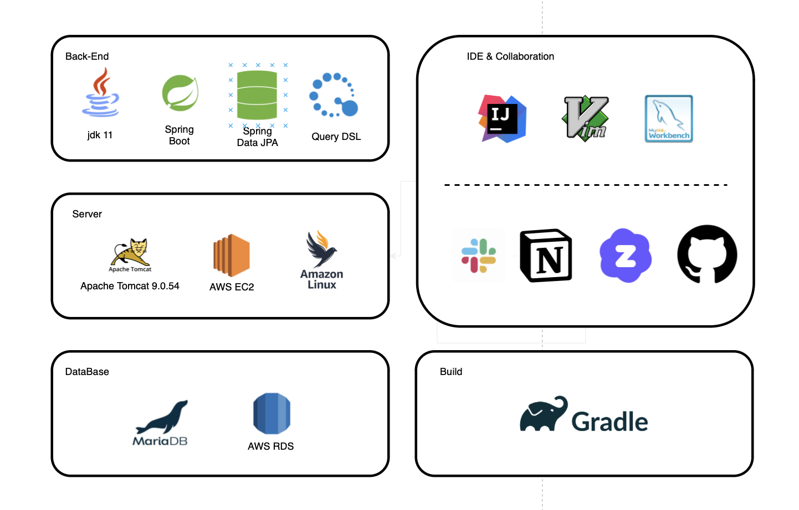

# 🌟Adu Calendar🌟
-------
### Adu Calendar?
>Adu Calendar(아듀 캘린더)는 Annual의 A와 duty의 du의 합성어로, 회사의 연차와 당직을 효율적으로 관리하는 캘린더 서비스를 제공합니다.

### 👩🏻‍💻참여
- 유현주 - 팀장
- 김태헌
- 정재은
- 류동우

### ⚒️기술스택
- **SpringBoot**
- **Rest Api**
- **JPA**
- **QueryDSL**
- **MockMvc**
- **AWS**

### 🔧협업 도구
- **Git**
- **GitHub**
- **Slack**

### 🗂️데이터베이스
- **MySQL**
- **h2**

### 시스템 아키텍쳐 설계

#### Focus Backend

### 🗒️구현 사항
#### ㅤ🙋🏻‍♀️**유저 관련 기능**
- 회원가입
- 로그인
- 사용자는 USER(일반 유저)와 ADMIN(관리자)로 구분
- 관리자는 각 유저의 권한 설정 가능
- 개인정보 수정, 삭제
#### ㅤ🗓️️**연차/당직 관련 기능**
- USER는 ADMIN에게 연차/당직 등록, 수정, 삭제 신청
- ADMIN은 USER의 신청을 승인/거절
- 캘린더에서 사용자들의 연차와 당직 보여주기
- USER 본인의 신청 내역과 신청 결과(승인/거절) 보여주기

**ㅤ자세한 기능 구현 사항은** 
<a href="files/REST%20API.pdf" target="_blank">api 문서</a>

### 🔗ER-Diagram

### 🎥시연 영상
#### 로그인

#### 회원가입

#### 전체 일정 조회

#### 일정 수정, 삭제 요청 - 권한 X

#### 로그인 되어 있지 않은 상태에서 수정, 삭제 시도, ADMIN 페이지 조회

#### 유저 상태에서 권한이 없는 일정 수정, 삭제 시도, ADMIN 페이지 조회

#### ADMIN 계정의 일정 승인, 수정, 삭제 요청 처리

#### 관리자 페이지 - 사용자 관리

#### 존재하지 않는 페이지 조회

#### 개인 정보 조회, 신청 일정 조회

